# osTicket Help Desk Home Lab


## Project Overview

This project demonstrates the deployment, configuration, and day-to-day use of an osTicket help desk environment to simulate a real-world IT support operation.

The lab includes technician management, department configuration, end-user support, ticket lifecycle management, internal documentation, and customer communication. Five common IT support scenarios were completed to demonstrate troubleshooting workflows and professional ticket handling.

### Ticket Workflow

```text
End User
    │
    ▼
Creates Ticket
    │
    ▼
osTicket Help Desk
    │
    ▼
Assigned Technician
    │
    ▼
Troubleshooting
    │
    ▼
Internal Notes
    │
    ▼
Customer Reply
    │
    ▼
Ticket Closed
```

---

## Objectives

- Deploy and configure an osTicket help desk environment
- Create realistic IT departments and technician accounts
- Simulate end-user support requests
- Document troubleshooting using internal technician notes
- Practice professional customer communication
- Manage tickets from creation through resolution
- Demonstrate common Help Desk and Desktop Support workflows

---

## Technologies Used

- osTicket
- Docker Desktop
- Docker Compose
- MariaDB
- Windows 11
- Visual Studio Code
- GitHub

---

## Project Features

### Help Desk Configuration

- Configured a multi-department help desk environment
- Created technician accounts with department assignments
- Added end users and simulated support requests
- Configured realistic Help Desk workflows

### Ticket Lifecycle Management

Each ticket followed a complete support workflow:

1. User submits ticket
2. Ticket assigned to technician
3. Internal troubleshooting notes documented
4. Technician communicates resolution
5. Ticket successfully closed

### Ticket Scenarios

The following real-world IT support scenarios were completed:

| Ticket | Scenario |
|---------|----------|
| Ticket 1 | Windows password reset |
| Ticket 2 | Office printer not printing |
| Ticket 3 | Network drive mapping issue |
| Ticket 4 | Outlook email synchronization |
| Ticket 5 | Network connectivity after workstation relocation |

---

## Skills Demonstrated

- Help Desk Administration
- Ticket Lifecycle Management
- Customer Service
- Technical Documentation
- IT Troubleshooting
- Active Directory Concepts
- Windows Desktop Support
- Microsoft Outlook Support
- Network Troubleshooting
- Printer Troubleshooting
- File Share & Network Drive Support
- Technician Documentation
- Professional Communication

---

## Project Screenshots

### Help Desk Configuration

| Admin Dashboard | Departments |
|----------------|-------------|
| 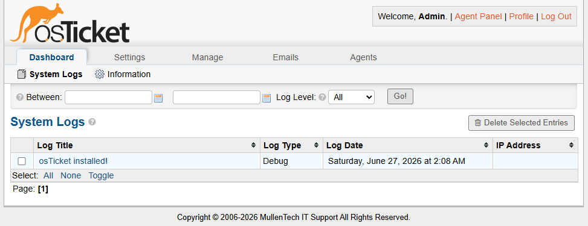 | 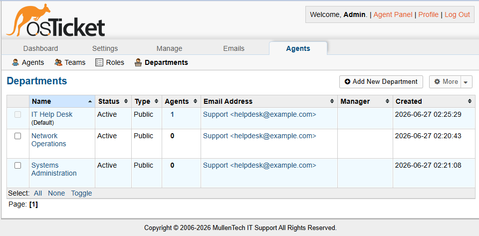 |

| Agents | Users |
|--------|-------|
| 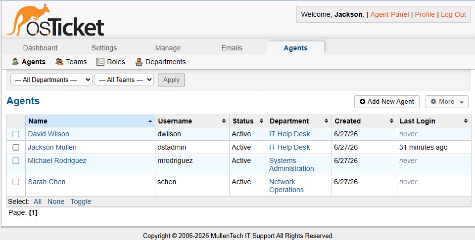 | 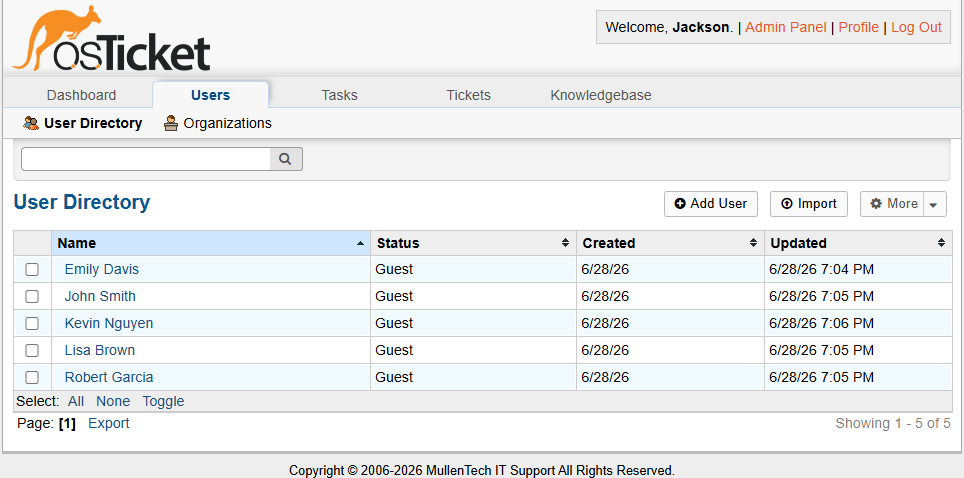 |

---

### Ticket 1 – Windows Password Reset

| Open | Thread | Closed |
|------|--------|--------|
| 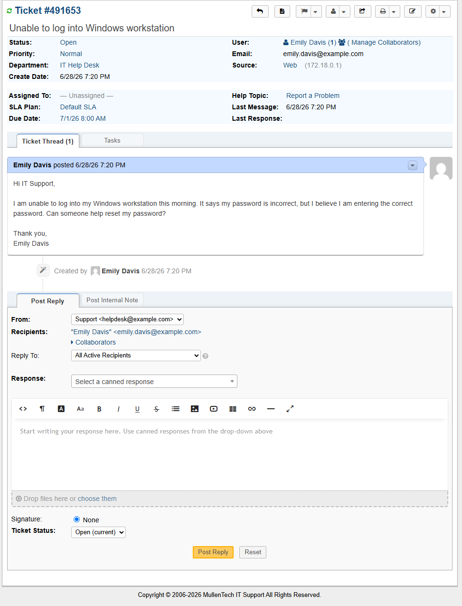 | 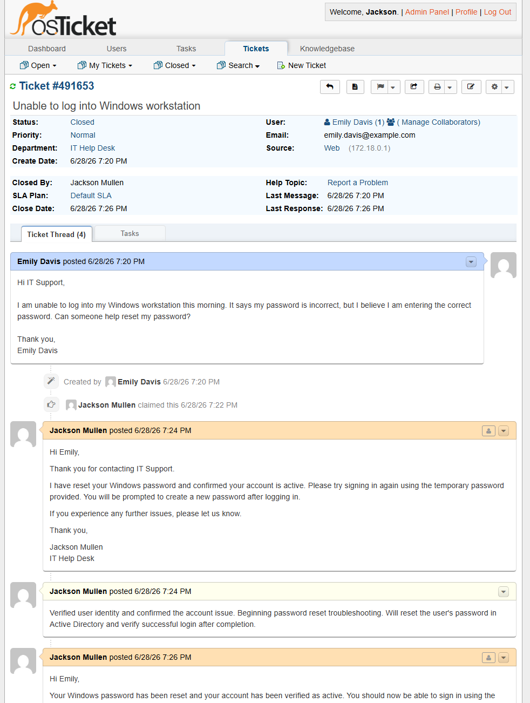 | 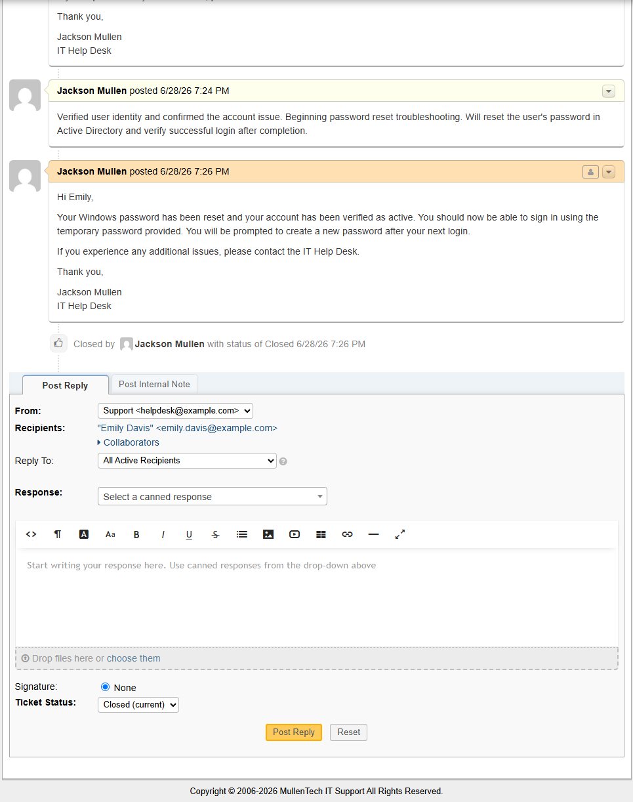 |

---

### Ticket 2 – Office Printer Issue

| Open | Closed |
|------|--------|
| 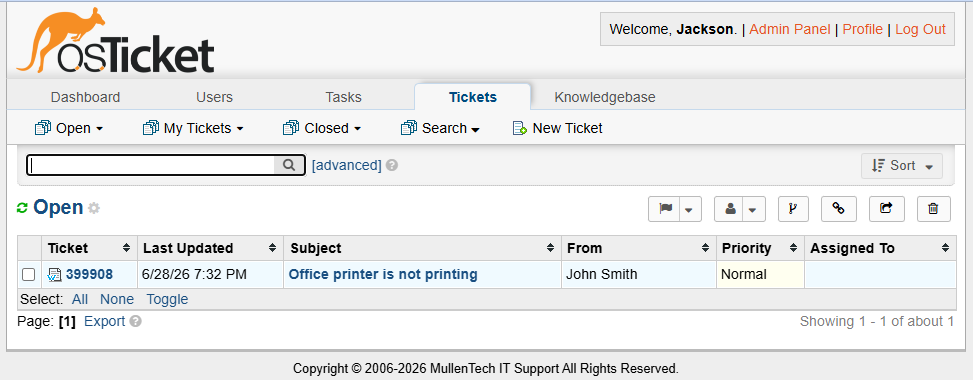 | 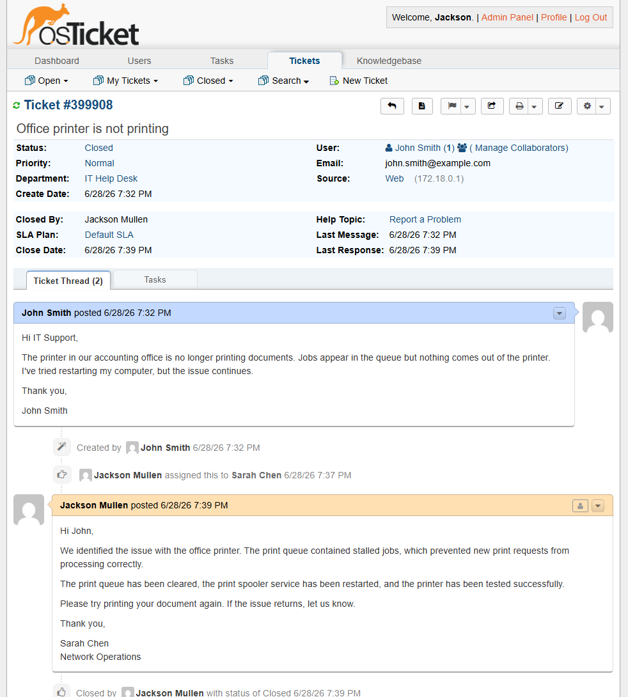 |

---

### Ticket 3 – Network Drive Issue

| Open | Thread | Closed |
|------|--------|--------|
| 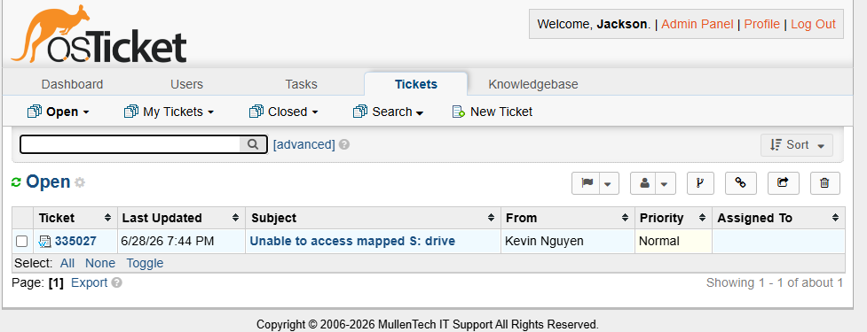 | 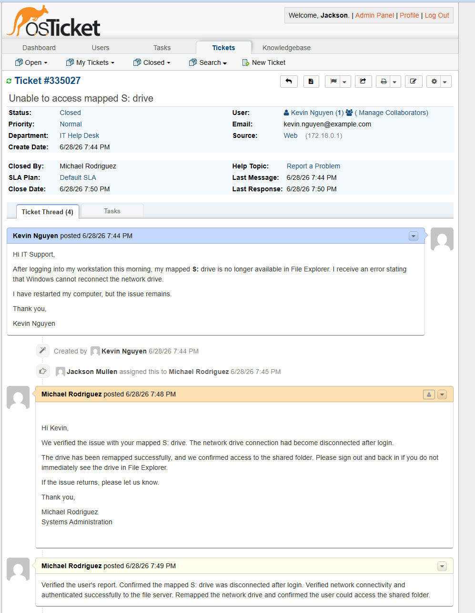 | 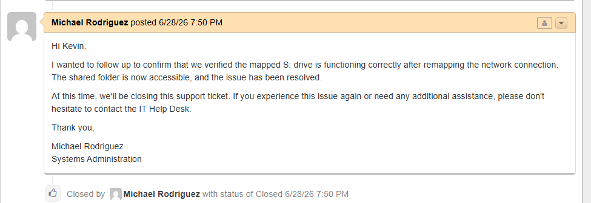 |

---

### Ticket 4 – Outlook Synchronization

| Open | Thread | Closed |
|------|--------|--------|
| 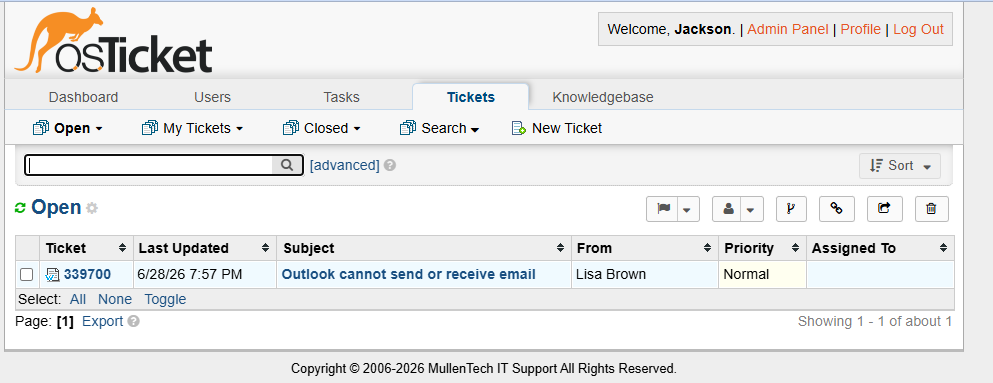 | 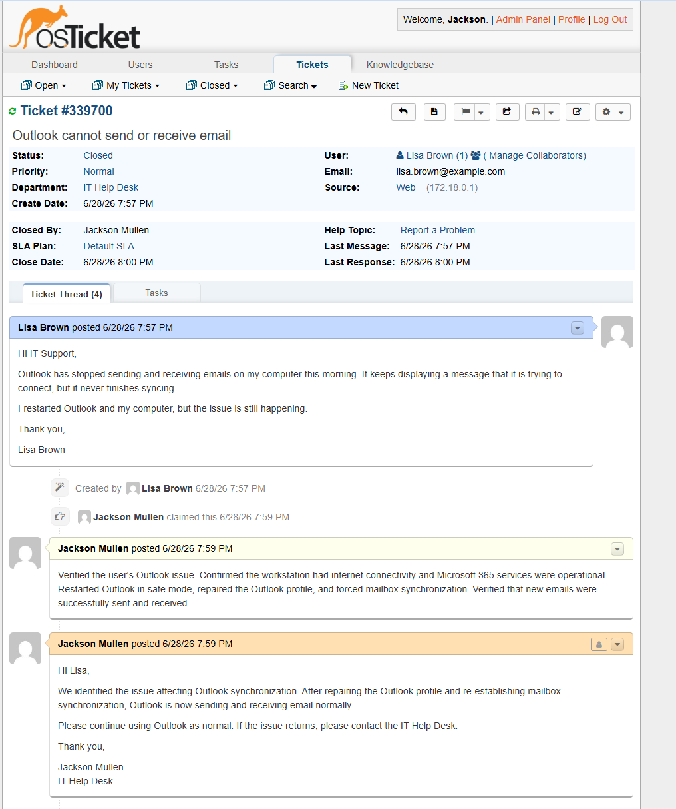 | 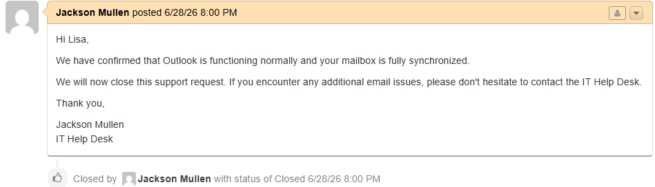 |

---

### Ticket 5 – Network Connectivity

| Open | Thread | Closed |
|------|--------|--------|
| 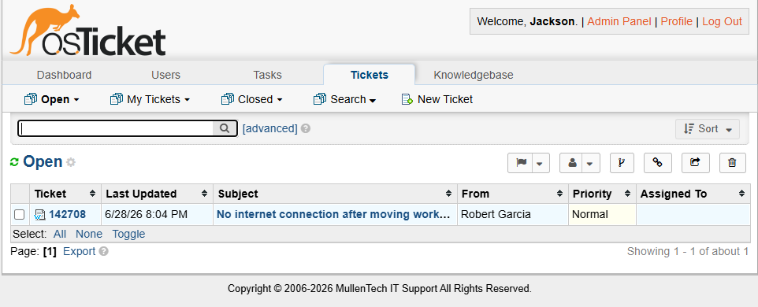 | 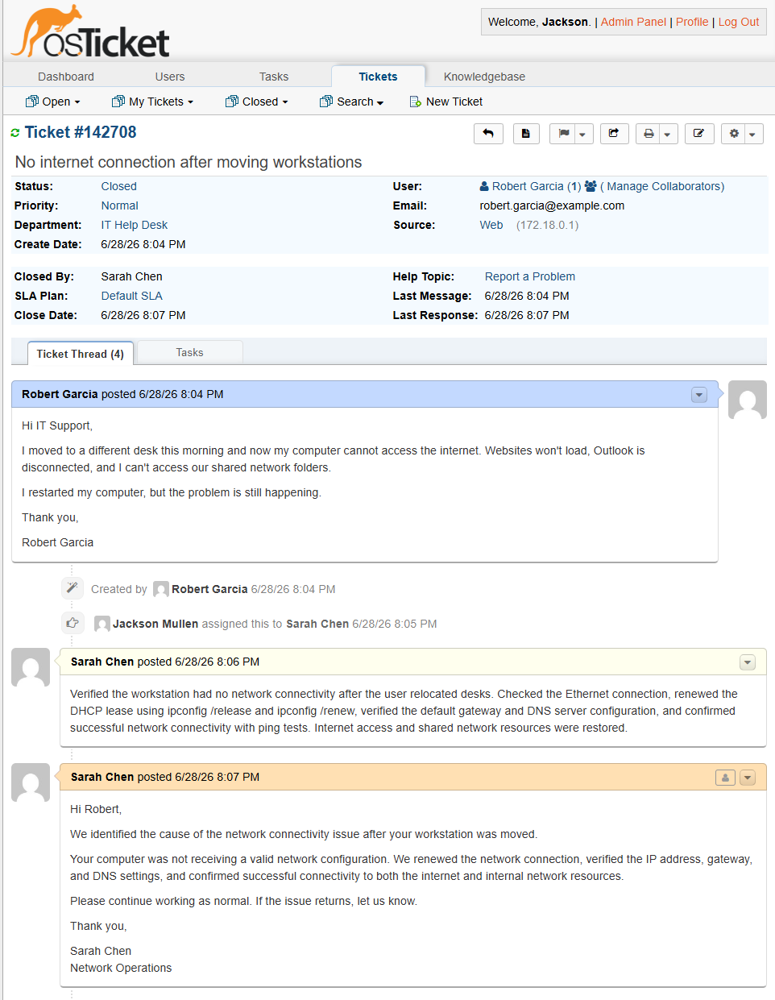 | 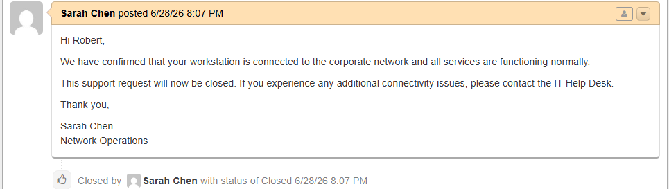 |

---

## Lessons Learned

This project strengthened my understanding of IT Help Desk operations by simulating common support scenarios from initial ticket creation through successful resolution.

Key takeaways include:

- Managing the complete ticket lifecycle from submission to closure
- Documenting troubleshooting using internal technician notes
- Communicating technical solutions clearly to end users
- Organizing technicians, departments, and users within a help desk platform
- Troubleshooting common Windows, Microsoft Outlook, printer, file share, and network connectivity issues
- Maintaining professional documentation that supports future troubleshooting and knowledge sharing

---

## Portfolio Summary

This project demonstrates practical experience with help desk administration, customer support, ticket lifecycle management, and technical troubleshooting using osTicket. Combined with my Active Directory Home Lab and Microsoft 365 Administration Lab, it represents a hands-on portfolio focused on the technologies and workflows commonly used in entry-level IT Support and Help Desk roles.
